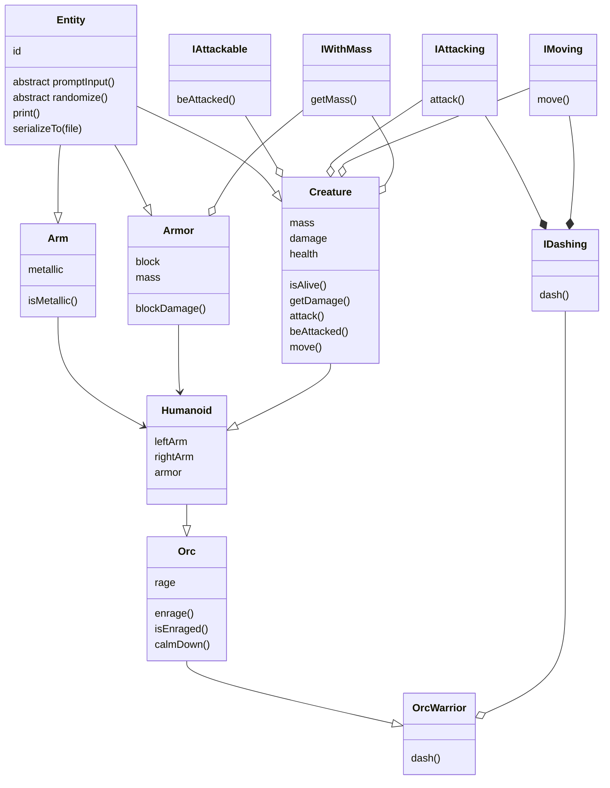

# Tehnici avansate de programare (Java), Laborator nr.2

Выполнил: **Curmanschii Anton**, IA1901.

[Ссылка на весь код для этой лабы на гитхабе](https://github.com/AntonC9018/uni_java/tree/master/lab2).

## Задания (Вариант 9)

1.	Описать иерархию классов (минимум 4). Базовый класс абстрактный с минимум 1 абстрактной функцией
2.	Описать class Main с функцией main вне иерархии
3.	Описать как минимум 2 интерфейса, каждый подключить минимум в 1 класс иерархии
4.	Каждый наследный класс должен иметь уникальные поля и методы
5.	Вызвать конструкторы классов родителей с параметрами и без 
6.	Вызвать обычные функции из классов родителей 
7.	Переопределить в каждом классе Randomize в дефолтном конструкторе
8.	Переопределить в каждом классе функцию ввода полей с клавиатуры
9.	Переопределить в каждом классе функцию записи в файл 						
10.	Создать минимум одну final : переменную && функцию && класс
11.	Создать минимум одну static : переменную && функцию
12.	Использовать instanceof и преобразование типов объектов 
13.	В main создать вектора объектов с типами: базовый класс && интерфейс 
14.	В функции main для созданных объектов вызвать уникальные функции их классов, вывести их на экран
15.	Описать в отчете собственный вариант работы так, как показано в примерах ниже.

## Планировка

Решил сделать иерархию по примеру видеоигры. `Entity` -> `Creature` -> `Humanoid` -> `Orc` -> `Orc Warrior`.



> Ремарка: иерархия классов, как правило, не используется в видеоиграх, потому что она слишком жесткая ( и не только). В видеоиграх обычно используются более гибкие компоненты, которые модифицируют `Entity`.

`Entity` обычно включает `entity_id` и список компонетов. Для лабы, оставим только айди.

`Creature`, скажем, будет включать позицию в мире (вектор из 2 компонентов), массу и значение атаки. Добавим метод проверки, если `Creature` находится на одной позиции с другим `Creature`. Еще добавим поле `health` и свойство `isAlive()`. Добавим виртуальныу методы `attack()` и `beAttacked()`. Добавим метод `move()` для смены позиции. Также добавим геттеры для массы и значения атаки.

`Humanoid` будет содержать по 2 объекта рук. Добавим также поле `armor`, которое будет содержать надетую броню. Заоверрайдим геттер значения атаки и метод `beAttacked()`, чтобы они учитывали броню и конечности. Заоверрайдим свойство массы, чтобы оно учитывало массу брони.

`Orc` добавляет характеристику `rage`. Заоверрайдим метод геттер значения атаки, чтобы он учитывал эту характеристику. Добавим  свойство `isEnraged()` и метод `enrage()`, который увеличивает `rage`.

`OrcWarrior` добавляет метод `dash()`, который одновременно перемещает его, и атакует цель.

Класс `Arm` наследуют `Entity` и содержит свойство `isMetallic()`, которое указывает, если рука металлическая.

Класс `Armor` наследует `Entity` и добавляет массу и броню.

Для сериализации используем встроенный в Java функционал. 

Как интерфейсы возьмем `IAttackable` с методом `beAttacked()`, `IAttacking` с методом `attack()`, `IMoving` с методом `move()`, и `IDashing`, который комбинирует `IMoving` и `IAttacking`, а также добавляет метод `dash()`. Также определим `IWithMass` с геттером для массы.

## Код

Для начала покажу код главной функции, которая демонтрирует использование всего, а потом посмотрим на отдельные классы.

Все действия описаны комментариями над кодом, на английском.

Для проверки правильной работы функий использованны `assert()`, которые крашат программу, если что-то не в порядке.

```java
import java.util.Arrays;

public class Main 
{
    public static void main(String[] args)
    {
        // Constructors with parameters
        OrcWarrior orcWarrior_1 = new OrcWarrior(
            // position, mass, health, damage, left arm, right arm, armor
            new Vector2(1, 1), 5, 5, 2, new Arm(false), new Arm(false), null
        );
        OrcWarrior orcWarrior_2 = new OrcWarrior(
            new Vector2(1, 5), 2, 2, 1, new Arm(true), new Arm(true), new Armor(1, 3)
        );
        Orc orc_1 = new Orc(
            new Vector2(1, 1), 5, 5, 2, null, null, new Armor(1, 3)
        );
        Orc orc_2 = new Orc(
            new Vector2(1, 1), 5, 5, 1, new Arm(false), new Arm(false), new Armor(0, 3)
        );
        Humanoid humanoid = new Humanoid(
            new Vector2(5, 5), 1, 1, 1, new Arm(false), new Arm(false), new Armor(0, 1)
        );
        Creature creature = new Creature(
            // position, mass, health, damage
            new Vector2(2, 2), 1, 1, 1
        );

        // Some randomized orcs
        OrcWarrior randomOrcWarrior = new OrcWarrior();
        randomOrcWarrior.randomize();
        // Assign an id automatically.
        // The randomizer does not assign an id to the top-level object
        Entity.autoId(randomOrcWarrior);

        Orc randomOrc = new Orc();
        randomOrc.randomize();
        Entity.autoId(randomOrc);


        // make sure both orc_1 and orc_2 are not dead by default 
        assert(orc_1.isAlive());
        assert(orc_2.isAlive());

        // save the current health
        int orc2_hp = orc_2.getHealth();
        // make orc 1 attack orc 2
        orc_1.attack(orc_2);
        // make sure orc 2 took damage (he has armor block value 0)
        assert(orc_2.getHealth() < orc2_hp);

        // save the current positions (note: creates a copy)
        Vector2 orc1_pos = orc_1.getPosition();
        // make orc 1 move 1 to the right
        orc_1.move(new Vector2(1, 0));
        // make sure orc_1 has moved
        assert(orc1_pos.x - orc1_pos.x == 1);

        // query the current attack damage
        int orc1_dmg = orc_1.getDamage();
        // enrage the orc, attack damage increased
        orc_1.enrage();
        // make sure it is bigger than before
        assert(orc_1.getDamage() > orc1_dmg);
        // make sure it is enraged
        assert(orc_1.isEnraged());
        // calm him down (damage restored to normal)
        orc_1.calmDown();
        // make sure damage gets back to normal
        assert(orc_1.getDamage() == orc1_dmg);

        // make the humanoid attack the creature until it's dead
        while (creature.isAlive())
        {
            humanoid.attack(creature);
        }
        // Now if we tried to attack the humanoid with the creature, 
        // it wouldn't work because the creature is dead
        creature.tryAttack(humanoid);
        // This will work though. This one is unconditional
        creature.attack(humanoid);

        // humanoids may reequip armor
        Armor new_armor = new Armor(5, 5);
        // unequips the current armor into humanoid_armor1 and equips the new armor
        Armor humanoid_armor_1 = humanoid.equipArmor(new_armor);
        // unequips the new armor into humanoid_armor2 and puts on the old armor
        Armor humanoid_armor_2 = humanoid.equipArmor(humanoid_armor_1);
        assert(humanoid_armor_2 == new_armor);

        // make two people at the same position
        Humanoid human_1 = new Humanoid(new Vector2(1, 1), 1, 1, 1, null, null, null);
        Humanoid human_2 = new Humanoid(new Vector2(1, 1), 1, 1, 1, null, null, null);
        // make sure this function works
        assert(human_1.isAtSamePoisition(human_2));
        // check again with a different positoin
        Humanoid human_3 = new Humanoid(new Vector2(2, 1), 1, 1, 1, null, null, null);
        assert(!human_1.isAtSamePoisition(human_3));

        // unequip the current armor of orc_1
        orc_1.equipArmor(null);
        // store their mass without the armor
        int orc1_mass = orc_1.getMass();
        // equip armor with mass of 1
        orc_1.equipArmor(new Armor(0, 1));
        // make sure the mass increased by one
        assert(orc1_mass == orc_1.getMass() - 1);

        // Print to the console
        orc_1.print();
        // Serialize to a file
        orc_1.serializeTo("orc.txt");

        // An array with these entities
        Entity[] entities = {
            orcWarrior_1,
            orcWarrior_2,
            orc_1,
            orc_2,
            humanoid,
            creature,
            randomOrcWarrior,
            randomOrc,
            new Arm(false) // also includes an unattackable arm
        };

        // Need to show all of them to the screen
        System.out.println("Printing all entities:");
        for (Entity e : entities)
        {
            System.out.printf("Classname: %s\n", e.getClass().getName());
            e.print();
        }

        // An an array of just attackable ones
        IAttackable[] attackables = 
            Arrays.stream(entities)
                .filter(e -> e instanceof IAttackable)
                .toArray(IAttackable[]::new);

        assert(entities.length - 1 == attackables.length);

        // Streams keep the order
        assert(attackables[0] == orcWarrior_1);
        // Attack the first attackable with 10 damage
        attackables[0].beAttacked(10);
        // It will die (since it has 5 hp)
        assert(((Creature)attackables[0]).isAlive() == false);

        // An array of just the ones that can dash, and are alive
        IDashing[] dashings = 
            Arrays.stream(entities)
                .filter(e -> e instanceof Creature && e instanceof IDashing)
                .filter(e -> ((Creature)e).isAlive())
                .toArray(IDashing[]::new);

        // It can dash
        dashings[0].dash(orc_1);

        // Create an empty creature and prompt input
        OrcWarrior warrior = new OrcWarrior();
        warrior.promptInput();
        // To properly set up the orc, an id has to be assigned
        Entity.autoId(warrior);

        // write it to a file
        warrior.serializeTo("warrior.txt");
    }
}
```

### Entity

В основе иерархии расположился класс Сущности `Entity`. Поскольку реализуем специфические сущности, наследуя от `Entity`, а не путем крепления к нему компонентов, данный класс будет абстрактным. Если класс абстрактный, значит его невозможно инстанциировать, но можно наследовать. 
```java
abstract class Entity 
```

Данный класс содержит 2 абстрактных метода, которые должны будут быть реализованы классами-потомками.
```java
public abstract void promptInput();
public abstract void randomize();
```

Как было описано ранее, `Entity` определяет лишь одно поле, `id`. Чтобы ограничить доступ к нему, сделаем публичный геттер и защищенный сеттер. Если функия защищенная, к ней можно обращаться только из одного пакета, или из потомков, но не из стороннего кода. Это поведение немного отличается от смысла этого ключевого слова в языках программирования C++ и C#, где protected допускает доступ только для данного класса и классов-потомков. Запретим оверрайдить эти методы, применив модификатор `final`. 
```java
private int id = 0;
public final int getId() { return id; }
protected final void setId(int id) { this.id = id; }
```

Определим, также в классе `Entity`, методы выдачи айди, определив статическое поле `currentId`, которое будет инкрементироваться при выдаче нового айди.
```java
private static int currentId = 0;
public static void autoId(Entity entity) 
{
    currentId++;
    entity.setId(currentId);
}
```

Еще определим также статическое финальное поле для сериализатора `Gson` и методы сериализации.
```java
private final static Gson gson = new GsonBuilder().setPrettyPrinting().create();
private final void serializeTo(Appendable stream)
{
    gson.toJson(this, stream); 
}
// some more stuff not shown
```

Определим также статический финальный генератор случайных чисел, который будет использован функциями сериализации, реализованными потомками.
```java
protected final static Random random = new Random(69); /*new Random();*/
```

Целый код:
```java
import java.io.FileWriter;
import java.io.IOException;
import java.util.Random;

import com.google.gson.Gson;
import com.google.gson.GsonBuilder;

abstract class Entity 
{
    private int id = 0;
    private static int currentId = 0;
    private final static Gson gson = new GsonBuilder().setPrettyPrinting().create();
    protected final static Random random = new Random(69); /*new Random();*/

    public final int getId() 
    {
        return id;
    }

    protected final void setId(int id) 
    {
        this.id = id;
    }

    public static void autoId(Entity entity) 
    {
        currentId++;
        entity.setId(currentId);
    }

    public abstract void promptInput();

    public abstract void randomize();

    public final void serializeTo(String file) 
    {
        try 
        {
            FileWriter stream = new FileWriter(file);
            serializeTo(stream);
            stream.close();
        } 
        catch (IOException e) 
        {
            e.printStackTrace();
        }
    }

    public final void print()
    {
        serializeTo(System.out);
        System.out.println();
    }

    private final void serializeTo(Appendable stream)
    {
        gson.toJson(this, stream); 
    }
}
```
### Creature

Следующий класс в иерархии — существо, `Creature`. 
```java
public class Creature extends Entity // ...
```

Существо определяет 4 новых поля, каждое из которых защищенное. Не сделал их приватными, потому что доступ к "сырым" значениям может быть полезен для классов-потомков. Например, умножение сырого урона при определенном условии.
```java
protected Vector2 position;
protected int mass;
protected int health;
protected int damage;
```

Геттер для позиции должен создать копию класса (в яве нельзя определять custom value types, по крайней мере я не знаю как).
```java
public final Vector2 getPosition()
{
    return new Vector2(position.x, position.y);
}
```

Вот остальные геттеры:
```java
public final int getHealth()
{
    return health;
}

public int getMass()
{
    return mass;
}

public int getDamage()
{
    return damage;
}
```

Изменять эти значения извне класса не имеет большого слысла, поэтому сеттеры не определены.

И вот они обязательные оверрайды абстрактных методов. `Prompt.whatever()` объясню чуть позже:
```java
@Override
public void promptInput() 
{
    position = new Vector2(
        Prompt.int_("x position"),
        Prompt.int_("y position")
    );
    mass   = Prompt.positiveInt("mass");
    health = Prompt.positiveInt("health");
    damage = Prompt.positiveOrZeroInt("damage");
}

@Override
public void randomize()
{
    position = new Vector2(random.nextInt(50), random.nextInt(50));
    mass   = random.nextInt(50) + 10;
    health = random.nextInt(5) + 2;
    damage = random.nextInt(3) + 1;
}
```

Также добавлены методы из интерфейсов (см. ниже). Интерфейсы реализуются используя ключевое слово `implements` и определением тела методов из интерфейса.

Весь код:
```java
public class Creature extends Entity 
    implements IWithMass, IAttackable, IMoving, IAttacking
{
    protected Vector2 position;
    protected int mass;
    protected int health;
    protected int damage;

    public Creature()
    {
    }

    public Creature(Vector2 position, int mass, int health, int damage)
    {
        super();
        Entity.autoId(this);
        this.position = position;
        this.mass = mass;
        this.health = health;
        this.damage = damage;
    }

    public void attack(IAttackable attackable)
    {
        attackable.beAttacked(getDamage());
    }

    public final void tryAttack(Creature creature)
    {
        if (isAlive() && creature.isAlive())
        {
            attack(creature);
        }
    }

    public void beAttacked(int damage)
    {
        if (damage > 0)
        {
            health -= damage;
        }
    }

    public final void move(Vector2 vec)
    {
        this.position.x += vec.x;
        this.position.y += vec.y;
    }

    public final boolean isAlive()
    {
        return health > 0;
    }

    public final Vector2 getPosition()
    {
        return new Vector2(position.x, position.y);
    }

    public final int getHealth()
    {
        return health;
    }

    public int getMass()
    {
        return mass;
    }

    public int getDamage()
    {
        return damage;
    }

    public final boolean isAtSamePoisition(Creature creature)
    {
        return creature.position.x == this.position.x 
            && creature.position.y == this.position.y;
    }

    @Override
    public void promptInput() 
    {
        position = new Vector2(
            Prompt.int_("x position"),
            Prompt.int_("y position")
        );
        mass   = Prompt.positiveInt("mass");
        health = Prompt.positiveInt("health");
        damage = Prompt.positiveOrZeroInt("damage");
    }
    
    @Override
    public void randomize()
    {
        position = new Vector2(random.nextInt(50), random.nextInt(50));
        mass   = random.nextInt(50) + 10;
        health = random.nextInt(5) + 2;
        damage = random.nextInt(3) + 1;
    }
}
```

### Humanoid

Следующий класс добавляет руки и броню. Нужные методы оверрайдятся, чтобы взять во внимание новые поля. Не буду объяснять чересчур детально, поскольку уже объяснил те же идеи в предыдущем классе. Упомяну только новое.

В оверрайдах, к примеру, геттера массы, используем синтаксис `super.getMass()`. Это вызывает геттер из класса-предка (суперкласса).
```java
@Override
public int getMass() 
{
    int mass = super.getMass();
    if (armor != null)
    {
        mass += armor.getMass();
    }
    return mass;
}
```

То же самое происходит и в методе, например, `promptInput()`. То есть, просим юзера ввести все поля предка, затем переходим к собственным:
```java
@Override
public void promptInput() 
{
    super.promptInput();
    // proper implementation 
    // ...
}
```

Весь код:
```java
public class Humanoid extends Creature 
{
    protected Arm leftArm;
    protected Arm rightArm;
    protected Armor armor;

    public Humanoid() 
    {
    }

    public Humanoid(Vector2 position, int mass, int health, int damage, Arm leftArm, Arm rightArm, Armor armor) 
    {
        super(position, mass, health, damage);
        this.leftArm = leftArm;
        this.rightArm = rightArm;
        this.armor = armor;
    }

    @Override
    public int getMass() 
    {
        int mass = super.getMass();
        if (armor != null)
        {
            mass += armor.getMass();
        }
        return mass;
    }

    @Override
    public int getDamage() 
    {
        int damage = super.getDamage();
        if (leftArm != null && leftArm.isMetallic()) 
        {
            damage += 1;
        }
        if (rightArm != null && rightArm.isMetallic()) 
        {
            damage += 1;
        }
        return damage;
    }

    @Override
    public void beAttacked(int damage) 
    {
        if (this.armor != null)
        {
            damage = this.armor.blockDamage(damage);
        }
        super.beAttacked(damage);
    }

    public Armor equipArmor(Armor armor) {
        Armor t = this.armor;
        this.armor = armor;
        return t;
    }

    @Override
    public void promptInput() 
    {
        super.promptInput();
        // This can be cleaned up with generics
        // That is Entity.promptCreate<Arm>(); or stuff like that
        // or with code generation (by a preprocessor program).
        if (Prompt.bool("left arm?", "yes", "no"))
        {
            leftArm = new Arm();
            Entity.autoId(leftArm);
            leftArm.promptInput();
        }

        if (Prompt.bool("right arm?", "yes", "no"))
        {
            rightArm = new Arm();
            Entity.autoId(rightArm);
            rightArm.promptInput();
        }

        if (Prompt.bool("armor?", "yes", "no"))
        {
            armor = new Armor();
            Entity.autoId(armor);
            armor.promptInput();
        }
    }

    @Override
    public void randomize()
    {
        super.randomize();
        
        if (random.nextBoolean())
        {
            leftArm = new Arm();
            Entity.autoId(leftArm);
            leftArm.randomize();
        }

        if (random.nextBoolean())
        {
            rightArm = new Arm();
            Entity.autoId(rightArm);
            rightArm.randomize();
        }

        if (random.nextBoolean())
        {
            armor = new Armor();
            Entity.autoId(armor);
            armor.randomize();
        }
    }
}
```

### Orc

Похожая ситуация и с орком, который оверрайдит `getDamage()`. Не буду даже включать сюда его код, поскольку ничего нового там нет. Можете посмотреть весь код на гитхабе (ссылка в начале документа).

### OrcWarrior

Упомянем класс `OrcWarrior`, который воодит новый интерфейс в иерархию.
```java
public class OrcWarrior extends Orc implements IDashing
```

Сам интерфейс комбинирует 2 интерфейса, и определен следующим образом:
```java
public interface IDashing extends IMoving, IAttacking 
{
    void dash(Creature creature);
}
```

Чтобы выполнить данный метод, определяем метод как обычно (виртуальный метод):
```java
public void dash(Creature creature)
{
    // implementation
    // ...
}
```

Заметим, что, поскольку иерархия уже определяет методы интерфейсов, которые наследовал интерфейс `IDashing`, орку-воину не нужно переопределять эти методы. 

Весь код смотрите на гитхабе.

### Prompt

Для инпута создал вспомогательный класс, чтобы избежать излишнего повторения кода. Этот класс включает методы запроса некоторый типов данных от юзера, каждый из которых держит его в `do-while`, пока не получит валидное значение, выводя на экран кастомное сообщение.

В Java нет понятия "статический класс", что означает класс-контейнер, который нельзя ни инстанциировать, ни наследовать. Однако есть возможность запретить инстанцирование из стороннего кода, сделав дефолтный конструктор приватным, и заблокировать наследование, сделав класс финальным.
```java
public final class Prompt 
{
    private Prompt(){}
    // ...
```

Таким образом, в статических классах имеют смысл только статические поля и функции. Покажу одну из функий, которая просит юзера ввести положительный инт. Она принимает кастомное сообщение, которое выдает на экран при вызове, и возвращает введенное число.
```java
public static int positiveInt(String message)
{
    int result = 0;
    boolean hasErrors;

    do
    {
        try
        {
            System.out.printf("Enter %s: ", message);
            String str = scanner.nextLine();
            result = Integer.parseInt(str);
            if (result <= 0)
            {
                System.out.printf("The number must be > 0\n");
                hasErrors = true;
            }
            else 
            {
                hasErrors = false;
            }
        }
        catch (NumberFormatException exc)
        {
            System.out.println("That's not a number.");
            hasErrors = true;
        }
    }
    while (hasErrors);
    return result;
}
```

Пример использования в коде мы уже встречали в классе `Creature`.
```java
mass   = Prompt.positiveInt("mass");
```

И вот пример диалога с юзером:
```
Enter mass: dfsg
That's not a number.
Enter mass:
That's not a number.
Enter mass: -7
The number must be > 0
Enter mass: 0
The number must be > 0
Enter mass: 8
```
После чего функция возвращает 8. 

## Запуск кода 

Видео с запуском кода из [NetBeans](https://youtu.be/SWsXxP6Rn-c).

При запуске кода в консоле не происходит много чего интересного: лишь сериализуются в json все созданные объекты и выводяться на экран, выводя параллельно, благодаря рефлексии, имя класса. 
```java
for (Entity e : entities)
{
    System.out.printf("Classname: %s\n", e.getClass().getName());
    e.print();
}
```

Вот пример сериализации и содержимого самого сериализованного объекта, сохраненного в файл `orc.txt`:
```java
orc_1.serializeTo("orc.txt");
```
```json
{
  "rage": 0,
  "armor": {
    "block": 0,
    "mass": 1,
    "id": 29
  },
  "position": {
    "x": 2,
    "y": 1
  },
  "mass": 5,
  "health": 5,
  "damage": 2,
  "id": 9
}
```

Для правильной десериализации необходимо также сохранять название класса, но, поскольку данная лаба не требует считывания из файла назад в память, не стал это реализовывать.

После этого юзера просят ввести нового орка-воина, после чего он сохраняется в файл `warrior.txt`:
```java
// Create an empty creature and prompt input
OrcWarrior warrior = new OrcWarrior();
warrior.promptInput();
// To properly set up the orc, an id has to be assigned
Entity.autoId(warrior);

// write it to a file
warrior.serializeTo("warrior.txt");
```

Пример диалога с юзером:
```
Enter x position: 4
Enter y position: 3
Enter mass: 5
Enter health: 5
Enter damage: 1
Enter left arm? ("yes" or "no"): yes
Enter arm's material ("metal" or "normal"): metal
Enter right arm? ("yes" or "no"): yes
Enter arm's material ("metal" or "normal"): g
"g" is not a valid option.
Enter arm's material ("metal" or "normal"): normal
Enter armor? ("yes" or "no"): yes
Enter armor block value: 5
Enter armor mass: 2
```

Сериализованный объект:
```json
{
  "rage": 0,
  "leftArm": {
    "metallic": true,
    "id": 31
  },
  "rightArm": {
    "metallic": false,
    "id": 32
  },
  "armor": {
    "block": 5,
    "mass": 2,
    "id": 33
  },
  "position": {
    "x": 4,
    "y": 3
  },
  "mass": 5,
  "health": 5,
  "damage": 1,
  "id": 34
}
```

Все остальные действия проверяются не через аутпут в консоль, а ассертами. Поскольку не наблюдаем крашей, все проверенные функции работают корректно.


## Выводы

В этой лабе доказал знания процесса наследования, применения интерфейсов, синтасксиса `static`, `final`, `extends`, `implements`, оввердайда методов, реализовал сериализацию, используя библиотеку `Gson`.


# Лабораторная работа 3, Exceptions.

## Задание

Реализовать 3 примера использования эксепшенов:

1. Для вынесения обработки ошибок в отдельный класс — класс ошибки. Я не смог найти применение этому методу в своем коде, поэтому просто покажу отдельный пример.

2. Ленивая функция — передача внутренней ошибки во внешний код.

3. Обработка стандартных эксепшенов.


## Вынесение обработки ошибок в класс ошибки

Вот один очень изощренный пример. Здесь, юзер оповещается через консоль о том, что значение value не было принято функцией, и причину этого. В ином случае, юзер оповещается о том, что значение было съедено. Для примера использовал верхний и нижний предел, как критерии ошибок. Создал отдельные классы ошибок для каждого из вариантов ошибки. У них есть метод `handle()`, который вызывается в блоке `catch`.

```java
public class Example
{
    public static void main(String[] args)
    {
        feed(ValueBound.lower - 1);
        feed(ValueBound.upper + 1);
        feed((ValueBound.lower + ValueBound.upper) / 2);
    }
    
    public static void feed(int value)
    {
        try
        {
            if (value < ValueBound.lower)
            {
                throw new ValueLowException(value);
            }
            if (value > ValueBound.upper)
            {
                throw new ValueHighException(value);
            }

            System.out.printf("Nom-nom... Delicious %d.\n", value);
        }
        catch(ValueException exc)
        {
            exc.handle();
            System.out.printf("Eugh... can't eat this stuff, sorry :/\n", value);
        }
    }
}

final class ValueBound
{
    private ValueBound(){}
    static final int lower = 5;
    static final int upper = 10;
}

abstract class ValueException extends RuntimeException
{
    int value;
    ValueException(int value) { this.value = value; }
    abstract void handle();
}

class ValueLowException extends ValueException
{
    ValueLowException(int value) { super(value); }

    @Override
    public void handle()
    {
        System.out.printf(
            "The value %d is too low. It must be no less than %d.\n", 
            value, ValueBound.lower
        );
    }
}

class ValueHighException extends ValueException
{
    ValueHighException(int value) { super(value); }

    @Override
    public void handle()
    {
        System.out.printf(
            "The value %d is too high. It must be no more than %d.\n", 
            value, ValueBound.upper
        );
    }
}
```

И вот он аутпут при запуске:
```
The value 4 is too low. It must be no less than 5.
Eugh... can't eat this stuff, sorry :/
The value 11 is too high. It must be no more than 10.
Eugh... can't eat this stuff, sorry :/
Nom-nom... Delicious 7.
```

## Ленивая функция

Добавим обработку ошибок в метод `setId()` класса `Entity`. Если айди уже было выставлено ранее (не равно 0), будем бросать ошибку. Сначала, добваим соответствующий класс ошибки:
```java
public class EntityIdInitializedException extends RuntimeException 
{ 
    public EntityIdInitializedException(String errorMessage) 
    {
        super(errorMessage);
    }
}
```

После этого, добавим проверку на ошибку в `setId()`.
```java
protected final void setId(int id) throws EntityIdInitializedException
{
    if (this.id != 0)
    {
        throw new EntityIdInitializedException("The id has been already set");
    }
    this.id = id;
}
```

Эта функция применяется только в одном месте, `autoId()`, который генерирует айди автоматически. Если позволим ошибке выйти из `autoId()`, тогда коду, который использует эту функцию, даже сразу после инстанциирования новой сущности, придется хандлить эту ошибку, хотя ее в таком случае явно быть не может, или декорировать метод, где данная функция применяется, как `throws EntityIdInitializedException`. Это как минимум раздражительно. Поэтому ловим ошибку в самом `autoId()` и просто информируем юзера об ошибке через консоль.
```java
public static void autoId(Entity entity) 
{
    currentId++;
    try
    {
        entity.setId(currentId);
    }
    catch(EntityIdInitializedException exception)
    {
        System.out.println("Sorry, cannot initialize the id twice.");
    }
}
```


## Стандартные ошибки

Стандартные ошибки уже обрабатывались в моем коде, при запросе юзера значений с клавиатуры. см. [Prompt](#prompt).