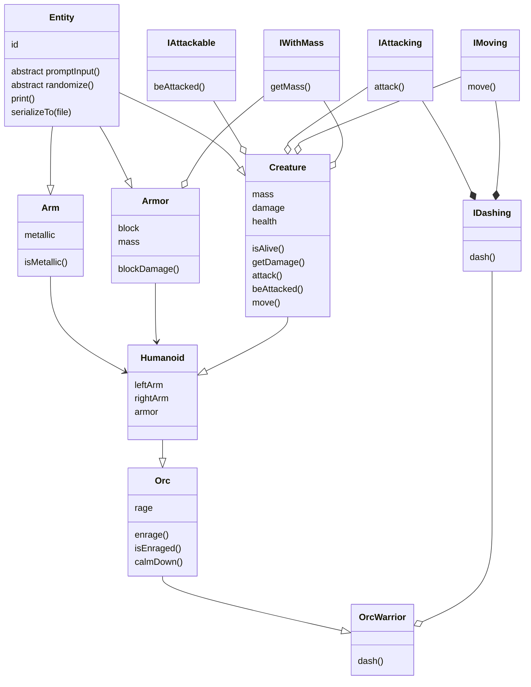

# Tehnici avansate de programare (Java), Laborator nr.2

Выполнил: **Curmanschii Anton**, IA1901.

## Задания (Вариант 9)

1.	Описать иерархию классов (минимум 4). Базовый класс абстрактный с минимум 1 абстрактной функцией
2.	Описать class Main с функцией main вне иерархии
3.	Описать как минимум 2 интерфейса, каждый подключить минимум в 1 класс иерархии
4.	Каждый наследный класс должен иметь уникальные поля и методы
5.	Вызвать конструкторы классов родителей с параметрами и без 
6.	Вызвать обычные функции из классов родителей 
7.	Переопределить в каждом классе Randomize в дефолтном конструкторе
8.	Переопределить в каждом классе функцию ввода полей с клавиатуры
9.	Переопределить в каждом классе функцию записи в файл 						
10.	Создать минимум одну final : переменную && функцию && класс
11.	Создать минимум одну static : переменную && функцию
12.	Использовать instanceof и преобразование типов объектов 
13.	В main создать вектора объектов с типами: базовый класс && интерфейс 
14.	В функции main для созданных объектов вызвать уникальные функции их классов, вывести их на экран
15.	Описать в отчете собственный вариант работы так, как показано в примерах ниже.

## Планировка

Решил сделать иерархию по примеру видеоигры. Скажем, возьмем следующие типы: `Entity` -> `Creature` -> `Humanoid` -> `Orc` -> `Orc Warrior`.



> Ремарка: иерархия классов, как правило, не используется в видеоиграх, потому что она слишком жесткая ( и не только). В видеоиграх обычно используются более гибкие компоненты, которые модифицируют `Entity`.

`Entity` обычно включает `entity_id` и список компонетов. Для лабы, оставим только айди.

`Creature`, скажем, будет включать позицию в мире (вектор из 2 компонентов), массу и значение атаки. Добавим метод проверки, если `Creature` находится на одной позиции с другим `Creature`. Еще добавим поле `health` и свойство `isAlive()`. Добавим виртуальныу методы `attack()` и `beAttacked()`. Добавим метод `move()` для смены позиции. Также добавим геттеры для массы и значения атаки.

`Humanoid` будет содержать по 2 объекта рук. Добавим также поле `armor`, которое будет содержать надетую броню. Заоверрайдим геттер значения атаки и метод `beAttacked()`, чтобы они учитывали броню и конечности. Заоверрайдим свойство массы, чтобы оно учитывало массу брони.

`Orc` добавляет характеристику `rage`. Заоверрайдим метод геттер значения атаки, чтобы он учитывал эту характеристику. Добавим  свойство `isEnraged()` и метод `enrage()`, который увеличивает `rage`.

`OrcWarrior` добавляет метод `dash()`, который одновременно перемещает его, и атакует цель.

Класс `Arm` наследуют `Entity` и содержит свойство `isMetallic()`, которое указывает, если рука металлическая.

Класс `Armor` наследует `Entity` и добавляет массу и броню.

Для сериализации используем встроенный в Java функционал. 

Как интерфейсы возьмем `IAttackable` с методом `beAttacked()`, `IAttacking` с методом `attack()`, `IMoving` с методом `move()`, и `IDashing`, который комбинирует `IMoving` и `IAttacking`, а также добавляет метод `dash()`. Также определим `IWithMass` с геттером для массы.

## Код

Для начала покажу код главной функции, которая демонтрирует использования всего, а потом посмотрим на отдельные классы.

Все действия описаны комментариями над кодом, на английском.

Для проверки правильной работы функий использованны `assert()`, которые крашат программу, если что-то не в порядке.

```java
import java.util.Arrays;

public class Main 
{
    public static void main(String[] args)
    {
        // Constructors with parameters
        OrcWarrior orcWarrior_1 = new OrcWarrior(
            // position, mass, health, damage, left hand, right hand, armor
            new Vector2(1, 1), 5, 5, 2, new Arm(false), new Arm(false), null
        );
        OrcWarrior orcWarrior_2 = new OrcWarrior(
            new Vector2(1, 5), 2, 2, 1, new Arm(true), new Arm(true), new Armor(1, 3)
        );
        Orc orc_1 = new Orc(
            new Vector2(1, 1), 5, 5, 2, null, null, new Armor(1, 3)
        );
        Orc orc_2 = new Orc(
            new Vector2(1, 1), 5, 5, 1, new Arm(false), new Arm(false), new Armor(0, 3)
        );
        Humanoid humanoid = new Humanoid(
            new Vector2(5, 5), 1, 1, 1, new Arm(false), new Arm(false), new Armor(0, 1)
        );
        Creature creature = new Creature(
            // position, mass, health, damage
            new Vector2(2, 2), 1, 1, 1
        );

        // Some randomized orcs
        OrcWarrior randomOrcWarrior = new OrcWarrior();
        randomOrcWarrior.randomize();
        // Assign an id automatically.
        // The randomizer does not assign an id to the top-level object
        Entity.autoId(randomOrcWarrior);

        Orc randomOrc = new Orc();
        randomOrc.randomize();
        Entity.autoId(randomOrc);


        // make sure both orc_1 and orc_2 are not dead by default 
        assert(orc_1.isAlive());
        assert(orc_2.isAlive());

        // save the current health
        int orc2_hp = orc_2.getHealth();
        // make orc 1 attack orc 2
        orc_1.attack(orc_2);
        // make sure orc 2 took damage (he has armor block value 0)
        assert(orc_2.getHealth() < orc2_hp);

        // save the current positions (note: creates a copy)
        Vector2 orc1_pos = orc_1.getPosition();
        // make orc 1 move 1 to the right
        orc_1.move(new Vector2(1, 0));
        // make sure orc_1 has moved
        assert(orc1_pos.x - orc1_pos.x == 1);

        // query the current attack damage
        int orc1_dmg = orc_1.getDamage();
        // enrage the orc, attack damage increased
        orc_1.enrage();
        // make sure it is bigger than before
        assert(orc_1.getDamage() > orc1_dmg);
        // make sure it is enraged
        assert(orc_1.isEnraged());
        // calm him down (damage restored to normal)
        orc_1.calmDown();
        // make sure damage gets back to normal
        assert(orc_1.getDamage() == orc1_dmg);

        // make the humanoid attack the creature until it's dead
        while (creature.isAlive())
        {
            humanoid.attack(creature);
        }
        // Now if we tried to attack the humanoid with the creature, 
        // it wouldn't work because the creature is dead
        creature.tryAttack(humanoid);
        // This will work though. This one is unconditional
        creature.attack(humanoid);

        // humanoids may reequip armor
        Armor new_armor = new Armor(5, 5);
        // unequips the current armor into humanoid_armor1 and equips the new armor
        Armor humanoid_armor_1 = humanoid.equipArmor(new_armor);
        // unequips the new armor into humanoid_armor2 and puts on the old armor
        Armor humanoid_armor_2 = humanoid.equipArmor(humanoid_armor_1);
        assert(humanoid_armor_2 == new_armor);

        // make two people at the same position
        Humanoid human_1 = new Humanoid(new Vector2(1, 1), 1, 1, 1, null, null, null);
        Humanoid human_2 = new Humanoid(new Vector2(1, 1), 1, 1, 1, null, null, null);
        // make sure this function works
        assert(human_1.isAtSamePoisition(human_2));
        // check again with a different positoin
        Humanoid human_3 = new Humanoid(new Vector2(2, 1), 1, 1, 1, null, null, null);
        assert(!human_1.isAtSamePoisition(human_3));

        // Print to the console
        orc_1.print();
        // Serialize to a file
        orc_1.serializeTo("orc.txt");

        // An array with these entities
        Entity[] entities = {
            orcWarrior_1,
            orcWarrior_2,
            orc_1,
            orc_2,
            humanoid,
            creature,
            randomOrcWarrior,
            randomOrc,
            new Arm(false) // also includes an unattackable hand
        };

        // Need to show all of them to the screen
        System.out.println("Printing all entities:");
        for (Entity e : entities)
        {
            System.out.printf("Classname: %s\n", e.getClass().getName());
            e.print();
        }

        // An an array of just attackable ones
        IAttackable[] attackables = 
            Arrays.stream(entities)
                .filter(e -> e instanceof IAttackable)
                .toArray(IAttackable[]::new);

        assert(entities.length - 1 == attackables.length);

        // Streams keep the order
        assert(attackables[0] == orcWarrior_1);
        // Attack the first attackable with 10 damage
        attackables[0].beAttacked(10);
        // It will die (since it has 5 hp)
        assert(((Creature)attackables[0]).isAlive() == false);

        // An array of just the ones that can dash, and are alive
        IDashing[] dashings = Arrays.stream(entities)
            .filter(e -> e instanceof Creature && e instanceof IDashing)
            .filter(e -> ((Creature)e).isAlive())
            .toArray(IDashing[]::new);

        // It can dash
        dashings[0].dash(orc_1);

        // Create an empty creature and prompt input
        OrcWarrior warrior = new OrcWarrior();
        warrior.promptInput();
        // To properly set up the orc, an id has to be assigned
        Entity.autoId(warrior);

        // write it to a file
        warrior.serializeTo("warrior.txt");
    }
}
```

